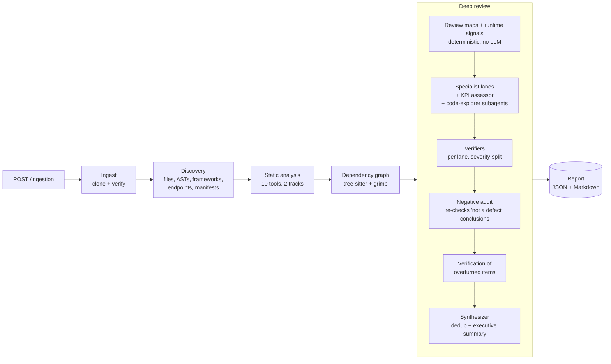

# CodeReviewer

CodeReviewer is an automated code-review service. Given a GitLab repository, it
clones the code, builds a deterministic model of it (files, routes and their authentication, data
flow, dependency graph, static analysis, security scans) and then runs a team of LLM review
agents. The agents read the real code, form and test hypotheses about it, verify each other's
work, and produce an engineering review in which every finding is cited to `file:line`,
severity-rated, classified by exposure and independently verified.

Version 1 reviews Python backends (FastAPI, Flask, Quart, Sanic, Django, Django REST framework,
aiohttp, Starlette, background workers and scripts), together with the browser frontend found in
the same repository (TypeScript/JavaScript). Frontend review can be switched off; see
[Frontend review](#frontend-review).

---

## Contents

1. [Architecture](#architecture)
2. [How a review runs](#how-a-review-runs)
3. [Pipeline stages](#pipeline-stages)
4. [The deep-review engine](#the-deep-review-engine)
   - [Deterministic context](#deterministic-context)
   - [Review lanes](#review-lanes)
   - [Agent roles](#agent-roles)
   - [How a specialist works](#how-a-specialist-works)
   - [Verification and audit](#verification-and-audit)
   - [Quality controls enforced in code](#quality-controls-enforced-in-code)
   - [Time, budgets and failure handling](#time-budgets-and-failure-handling)
5. [The report](#the-report)
6. [Frontend review](#frontend-review)
7. [Data handling](#data-handling)
8. [Results](#results)
9. [Project structure](#project-structure)
10. [Setup and configuration](#setup)
11. [API flow](#api-flow)
12. [Describing your system (`AGENTS.md`)](#describing-your-system-agentsmd)
13. [Tuning and extending the review](#tuning-and-extending-the-review)
14. [Testing](#testing)

---

## Architecture



The pipeline is one [LangGraph](https://github.com/langchain-ai/langgraph) graph of five stages.
Each stage is a thin node (`src/nodes/`) that delegates to its controller (`src/controllers/`). The
agents are built on [deepagents](https://github.com/langchain-ai/deepagents) and run on Google
Gemini models.

## How a review runs

1. **Request.** A user submits a GitLab URL and access token (`POST /api/v1/ingestion/repositories`).
   The API validates the input, creates a `PENDING` review, returns `202` with its id, and starts
   the pipeline as a background task.
2. **Clone.** The repository is cloned into an isolated workspace, integrity-checked and published
   atomically. The token exists only in the background task's memory.
3. **Discover.** Every file is classified (language, size, test or source), Python files are
   parsed, frameworks, entry points and endpoints are detected, and dependency manifests are read.
   The result is a versioned, cached `RepositoryManifest`.
4. **Analyse statically.** Ten tools run, structural ones in sequence and security ones in
   parallel. Their findings are normalized into one format and content-hashed.
5. **Map the code.** A dependency graph of functions, classes, calls and module imports is built.
6. **Build the review context.** Before any LLM runs, a deterministic pass builds tables of the
   system:
   - every route with the auth that really applies to it;
   - environment reads, reachability and background jobs;
   - runtime signals and risk hotspots;
   - each lane's file scope.

   These tables, plus the static findings routed to each lane, become mandatory leads.
7. **Review in parallel.** One specialist agent per enabled lane (security, authentication,
   correctness, performance, frontend, …) reviews the repository at the same time as the others.
   Each:
   - builds a model of the system and its invariants;
   - records and investigates its own hypotheses;
   - sweeps its whole file scope with parallel code-explorer subagents;
   - closes every lead.

   The security lane also has a dedicated KPI assessor for the mandatory security checklist.
8. **Verify.** As soon as a lane finishes, a verifier agent tries to disprove each of its findings:
   confirming, adjusting severity, title, impact or exposure, or rejecting with the code that
   disproves the claim. A negative auditor then re-checks every "not a defect" conclusion, and
   anything it overturns is verified the same way.
9. **Synthesize.** A synthesizer agent merges duplicates across lanes and writes the executive
   summary: scope, verdict, priority order and root causes.
10. **Report.** The structured report (JSON) and its Markdown rendering are stored and served by
    the API. Progress is visible throughout through the status endpoint and the web UI.

## Pipeline stages

| # | Stage | What it does | Output |
| --- | --- | --- | --- |
| 1 | **Ingest** | Clones the GitLab repository into an isolated workspace, verifies it and publishes it to `cloned_repos/<repository_id>/`. | Local clone |
| 2 | **Discovery** | Deterministic scan: file classification, Python ASTs, frameworks, entry points, HTTP endpoints, dependency manifests. | `RepositoryManifest` |
| 3 | **Static analysis** | Structural (sequential): `ruff`, `pyright`, `radon`, `vulture`, `jscpd`, `lizard`. Security (concurrent): `pip-audit`, `semgrep` (bundled offline rules), `bandit`, `gitleaks`. | Normalized static findings |
| 4 | **Dependency graph** | [tree-sitter](https://tree-sitter.github.io/) function/class/call extraction and [grimp](https://github.com/seddonym/grimp) module imports (isolated in a subprocess, because building it imports the target's code). | `DependencyGraph` |
| 5 | **Deep review** | The multi-agent review described below. | `DeepReviewReport` |

Every stage after Ingest is cached by content hash: commit SHA, engine and schema version, and,
for the deep review, the hash of the review configuration. Re-submitting an unchanged repository at
the same commit returns the cached result.

## The deep-review engine

### Deterministic context

Before any agent starts, `helpers/review_maps.py`, `helpers/route_frameworks.py` and
`helpers/review_signals.py` build tables of the whole codebase without an LLM. They are mounted
read-only at `/_review/context/`, and each agent works through the rows relevant to its lane:

| File | Contents |
| --- | --- |
| `system_overview.md` | Components, declared runtimes (requires-python, base images, Node versions), entry points, API surface by area and auth, data stores, external services, background work, client, tests and CI. |
| `route_map.md` | Every HTTP route of every supported framework with its full path (router, blueprint and include prefixes resolved). Also: the auth that really applies (FastAPI dependencies and `Annotated` aliases, decorators, mixins, DRF permission classes, app-level hooks), identity values read from the request, and flags: `CLIENT-ASSERTED IDENTITY`, `NO AUTH DEPENDENCY`, `AUTH ENTRY POINT`, `FILE UPLOAD`. |
| `env_map.md` | Every environment read with its inline default, keys whose defaults diverge between modules, and a value-free inspection of every `.env*` file (duplicates; weak, short, localhost or browser-exposed values). |
| `reachability.md` | Python modules no entry point reaches. Entry points are, among others: app constructors, launch commands (`uvicorn main:app`, `python -m`), app factories, worker tasks, schedulers, queue consumers, Django management commands, and modules loaded by name (Celery `include`, Django `include` and `INSTALLED_APPS`, `importlib`). |
| `architecture.md` | Process-local state; background jobs (in-process tasks, Celery/RQ/Dramatiq tasks, schedulers, consumers); queries that ignore the caller's identity; client pages without an auth guard. |
| `client_calls.md` | Client API calls matched against backend routes: calls with no route, and routes no client calls. |
| `runtime_signals.md` | Behaviour of the running system beyond the linters (see below). |
| `scopes.md` | The files each lane must open. Every live source file belongs to at least one lane. |
| `agents_md.md` | The repository's `AGENTS.md`, when present. |

**Runtime signals.** Each signal is a deterministic detector whose results become mandatory leads
for the lane that owns it:

| Area | Signals |
| --- | --- |
| Risk hotspots | Functions that combine several kinds of side effect (database writes, network, files, subprocesses, model calls, locks, messaging, background work), followed two calls deep and ranked by route-handler status, size and broad exception handling. |
| Data and lifecycle | Request-scoped DB sessions passed to background work, fire-and-forget tasks, session dependencies that leak on error, ORM tables no migration creates, text cleaning that rewrites identifier characters (emails, URLs, ids, dates), whole-file rewrites, naive datetimes, unbounded reads. |
| Security | Session fixation (identity written into a session that is never renewed), response models that return password hashes or keys, security controls defined but applied nowhere, credentials in query strings, secrets or personal data shipped in the image or tree, privileged containers, third-party data processors. |
| Runtime | Blocking or synchronous work reached from async code, model clients built at import, agent loops that resend their history, unbounded tool output, token usage never read, subprocesses without timeouts, startup fragility, process-local state. |
| Operations | `print()` in live modules, health checks that check nothing, which tests drive the API, CI pipelines and missing scan steps, pipeline hygiene, deploy-manifest environment conflicts, missing lockfiles, unpinned images. |
| Structure | Parallel implementations of one operation, layer import cycles, duplicate libraries, unused dependencies. |

**Bundled semgrep rules** (`src/assets/semgrep/`, offline and project-owned): 57 rules. Each is
routed to the lane that judges it.

- `python-security.yml`:
  - injection: SQL, SQLAlchemy `text()`, shell, `eval`/`exec`, template injection;
  - unsafe deserialization and XML parsing;
  - weak hashes and random generators;
  - disabled TLS or JWT verification;
  - CORS wildcard with credentials;
  - debug mode;
  - upload filenames reaching filesystem paths;
  - exception text returned to clients;
  - insecure secret defaults and static mounts;
  - blocking calls in async code;
  - HTTP calls without timeouts;
  - model-specific patterns.
- `python-web-app.yml`:
  - mass assignment and open redirects;
  - `assert` used as an access check;
  - cookies without HttpOnly/Secure;
  - `jwt.decode` without an algorithm list;
  - secrets compared with `==`;
  - archive extraction without path checks;
  - secrets written to logs;
  - swallowed exceptions;
  - mutable default arguments;
  - process-wide database sessions;
  - money stored as float.
- `web-security.yml` (browser code):
  - XSS sinks;
  - iframe sandbox escapes;
  - secrets in public build variables;
  - credentials in URLs or web storage;
  - spreadsheet exports;
  - dynamic code execution;
  - `postMessage` without origin checks;
  - redirects built from URL parameters.

### Review lanes

Each enabled category in `src/assets/review_config.toml` gets one specialist agent. All lanes run
concurrently, with heavier lanes started first and given proportionally more time.

| Lane | Code | Scope |
| --- | --- | --- |
| Security & Authorization | `SEC` | Authorization per route and per object (IDOR), client-asserted identity, injection, SSRF, business-logic abuse, multi-tenant isolation, webhook verification, response over-exposure, data exposure and privacy. Owns the security KPI checklist. |
| Authentication, Sessions & Tokens | `AUTH` | Token and session lifecycle, credential flows, rate limiting and lockout, user enumeration, cryptographic randomness, session rotation. |
| Upload Governance & Input Controls | `INP` | Every input path: content-type validation, size limits, parser abuse, quotas, job cancellation and recovery, request validation. |
| Correctness & Data Integrity | `BUG` | Core flows end to end, logic errors, lossy normalization, check-then-act races, idempotency, transactions, async and ORM pitfalls, locks that survive a crash, errors reported as success. |
| Integration & Configuration | `INT` | Settings and defaults, externally visible URLs, the API contract, outbound calls, operational scripts (migrations, entrypoints, shell, SQL). |
| Performance & Scalability | `PERF` | Event-loop blocking, horizontal scaling, growth with data, N+1 queries, transactions held across slow work, connection pools, memory growth. |
| Logging, Observability & Governance | `OBS` | Tracing, logging, health checks, metrics, durability of failure information, backups. |
| Testing & CI | `TST` | What the tests exercise, tests that cannot fail, CI gates, migrations tested the way production runs them. |
| Environment & Secrets | `ENV` | Hard-coded and default secrets, startup validation, configuration and build-artifact governance. |
| Dependencies & Supply Chain | `DEP` | Known vulnerabilities, reproducibility, lockfiles, end-of-life runtimes, unused or duplicate packages. |
| Dead Code, Duplication & Architecture | `MNT` | Proven dead code, diverged duplicates, layering and import cycles. |
| AI/LLM Usage | `LLM` | Applies when the code calls models: what one request sends, token growth, cost measurement, attribution and enforcement, robustness, oversight of automated decisions. |
| Frontend & Client Security | `WEB` | The browser client: what the bundle exposes, XSS sinks, unsafe URLs, client-side exports, auth flow and route guards, the HTTP client, resilience. Enabled by default; see [Frontend review](#frontend-review). |

Each lane's checklist (`focus` in the configuration) is a list of questions the lane answers about
the system. The security KPI checklist has 12 mandatory items, each assessed as
open, partially open, closed, not applicable or not verified, with evidence:

- rate limiting on authentication;
- API docs and debug endpoints exposed in production;
- formula injection in exports;
- stored XSS;
- authorization on served files;
- server path disclosure and internal-host disclosure;
- `Content-Disposition` injection;
- security headers;
- upload content validation;
- unsafe content in exports.

### Agent roles

| Role | Model | Responsibility |
| --- | --- | --- |
| **Specialist** (one per lane) | `GEMINI_MODEL`; the correctness lane uses the judge model | Reviews its lane end to end and records findings. |
| **KPI assessor** | `GEMINI_MODEL` | Assesses each security KPI with evidence, in parallel with the security specialist. |
| **Code explorer** (subagent) | `GEMINI_MODEL` | Read-only sweeps a specialist launches in parallel, e.g. "read these files and report every defect relevant to authentication". |
| **Verifier** (per lane) | judge for Critical/High, base for Medium/Low | Attempts to disprove each finding. |
| **Negative auditor** (per lane) | judge | Re-checks the lane's "not a defect" conclusions. |
| **Synthesizer** | judge | Merges duplicates across lanes and writes the executive summary. |

### How a specialist works

A specialist goes through four phases. A completion check sends it back if any phase is
incomplete.

1. **Understand.** Read the system overview, `AGENTS.md`, entry points and core modules. Work out
   the system's purpose, flows, trust boundaries and the invariants that matter for the lane, for
   example "each record has one owner", "a job runs once", "a caller only sees their own data", "a
   lock is always released".
2. **Hypothesize.** Record a system model and at least six suspicions specific to this repository.
   Each names the code it concerns, and describes a concrete path that could break an invariant: an
   error path, a second caller, a concurrent request, a restart, an unusual input.
3. **Investigate.** Prove or disprove each hypothesis in the code, open every file in the lane's
   scope (in parallel through code explorers), and follow anything else relevant.
4. **Close the leads.** Every deterministic lead ends one of three ways: as a finding that cites
   it, attached to an existing finding, or dismissed with the code that shows it is not a defect.

### Verification and audit

- **Verifiers** receive a lane's findings in batches of eight, Critical/High on the judge model,
  Medium/Low on the base model. For each finding they:
  - re-open the cited code and look for guards, callers, configuration and dead-code status;
  - check the impact against the mechanism;
  - confirm, adjust or reject the finding.

  Anything a batch could not finish gets one more pass. Findings still unverified after that are
  marked as such in the report.
- **The negative auditor** re-checks every ruled-out hypothesis and dismissed lead. It either
  upholds the conclusion, citing the code that makes it safe on every path, or overturns it into a
  finding that then goes through normal verification.
- **The synthesizer** folds findings that report the same defect from different lanes, and bases
  the verdict and priority order on verified findings.

### Quality controls enforced in code

The agents' tools (`helpers/review_workspace.py`) refuse work that does not meet the standard:

- **Evidence.** A finding needs valid repository `file:line` citations. Findings located in
  unreachable code are labelled latent, and severity is capped by exposure: latent at most High,
  dead or theoretical at most Medium.
- **Checked claims.** A "does not parse / cannot import" claim is refused when the file compiles,
  or when the project declares a newer Python than the checker has. A claim that something is
  unused needs a reference search showing no use.
- **Hypotheses.** Each must name the code it concerns. Hedged lists of risks and near-duplicates
  are refused. A confirmation must point to a finding about the same defect, and ruling one out
  requires code that addresses it.
- **Dismissals.** Reasons such as "out of time" or "partially checked" are refused. So is a reason
  that relies only on `finally`/`except` cleanup for a persisted lock, flag or job, unless it names
  a recovery mechanism: expiry, startup reset, heartbeat or owner check.
- **Verification.** A rejection must cite the code that disproves the claim, cannot rest on a
  checklist not mentioning the issue, and must be about the finding it names.
- **Static analysis.** Severe tool results judged real must appear in a finding, and cannot be left
  untriaged.
- **Coverage.** A lane cannot finish with unopened files in its scope, unresolved hypotheses or
  open leads. The completion check supplies the parallel sweep calls needed to finish.
- **Scope.** When the frontend lane is disabled, a finding whose only evidence is client code is
  refused.

### Time, budgets and failure handling

- Every agent has a wall-clock limit (`DEEP_REVIEW_AGENT_TIMEOUT_SECONDS`, scaled by lane effort)
  and a model-call budget. Each model call is bounded by the remaining time, and an agent near its
  limit stops gracefully, keeping everything it has recorded.
- Lanes run concurrently up to `DEEP_REVIEW_MAX_CONCURRENCY`, and each lane's verification starts
  as soon as that lane finishes.
- A failed or timed-out agent never fails the review. Its section shows a coverage warning, and the
  coverage table records each agent's outcome.
- A failure in any pipeline stage marks the review `failed` with the error.

## The report

The report is produced as structured JSON (`DeepReviewReport`) and as Markdown, both stored in the
database and served by the API:

| Section | Contents |
| --- | --- |
| 0. Priority order | Ranked themes, most blocking first, with the finding ids behind each. |
| 0.1 Security KPIs | Every KPI with status and evidence. |
| One section per lane | Findings with severity, exposure, evidence, impact and verification status. |
| Static-analysis triage | Per tool: findings judged real, false positive or low value. |
| Cross-cutting summary | Root causes that explain several findings. |
| Review coverage | Computed, not model-generated: files opened per lane, agent outcomes, open leads, findings from the agents' own investigation. |
| Appendix A | Inventory of the repository. |
| Appendix B | Claims rejected by verification, with the reason. |
| Appendix C | Leads dismissed by the specialists, with the reason. |
| Appendix D | Every hypothesis recorded and its outcome. |

## Frontend review

The frontend lane (`WEB`) is **enabled by default**. When the repository contains a browser client
(TypeScript/JavaScript, React, Vue, Svelte and similar), its files form the lane's scope, the
browser semgrep rules and client route guards become its leads, and the KPI assessor also checks
the KPIs that live in client code.

**To stop reviewing the frontend**, set `enabled = false` under the `frontend` category in
`src/assets/review_config.toml`. The review then covers the backend only:

- client folders, TypeScript/JavaScript sources and bundler configuration are in no lane's scope;
- findings that cite only client code are refused;
- client code remains context for the other lanes (which routes it calls, what the backend sends
  it);
- backend issues that reach the browser stay in scope: server-rendered HTML, CORS, cookies,
  security headers, and secrets the backend hands to the client.

Because the configuration's hash is part of the cache key, the change takes effect on the next
review without any other step.

## Data handling

- The GitLab access token is never stored or logged; it exists only in the running task's memory.
- Agents have read-only access to the clone, and everything in the repository is treated as data,
  never as instructions.
- Real `.env` files are never opened by agents. Their key names and value flags are computed
  locally, and the values never leave the process. `DEEP_REVIEW_INSPECT_ENV_FILES=false` skips them
  entirely.
- All data is scoped to the signed-in user; other users' ids return 404.

## Results

Review runs on four repositories, with the default models (`gemini-2.5-flash` with
`gemini-3.1-pro-preview` as judge). Finding counts are after independent verification.

| Repository | Type | Findings (C / H / M / L) |
| --- | --- | --- |
| Internal talent-acquisition system | FastAPI + LLM backend with a React client | 130 (10 / 52 / 61 / 7) |
| [dvpwa](https://github.com/anxolerd/dvpwa) | aiohttp application with documented vulnerabilities | 57 (6 / 10 / 35 / 6) |
| [FastAPI full-stack template](https://github.com/fastapi/full-stack-fastapi-template) | Reference FastAPI project | 53 (0 / 8 / 37 / 8) |
| [Damn Vulnerable RESTaurant API](https://github.com/theowni/Damn-Vulnerable-RESTaurant-API-Game) | FastAPI API with documented vulnerabilities | 56 (12 / 14 / 25 / 5) |

**Internal talent-acquisition system.** The run reported the issues raised in the team's manual
review of the same code:

- user identity taken from client-controlled headers without verification;
- a screening lock that stays set after a process restart;
- an email endpoint that sends unsanitized HTML to arbitrary recipients (phishing);
- a migration script that runs `alembic stamp head` instead of `upgrade`;
- known vulnerabilities in `python-multipart`;
- path traversal in an upload handler;
- CV text cleaning that rewrites `_`, `@` and `:` and so corrupts e-mail addresses.

The same run also reviewed the React client (frontend lane), reporting among others an API key
exposed in the browser bundle and unsanitized HTML rendered in an iframe.

**dvpwa.** The project documents five vulnerabilities:

| Vulnerability | Run result |
| --- | --- |
| SQL injection | Reported (Critical) |
| Weak password storage (MD5) | Reported (Critical) |
| Stored XSS | Reported (Critical) |
| Session fixation | Reported (High) |
| CSRF protection disabled | Not reported in this run; reported in earlier runs. A detector for security controls that are defined but never applied has since been added and flags this case. |

The run also reported routes that read and modify data without authentication.

**FastAPI full-stack template.** No Critical findings. The main High findings:

- the new-account e-mail contains the password in plain text;
- password-reset tokens can be reused until they expire;
- no rate limiting on authentication;
- JWTs are not revoked on logout or password change;
- e-mail sending has no timeout;
- a committed `.env` with weak default secrets.

**Damn Vulnerable RESTaurant API.** The run reported the documented
vulnerabilities:

- SQL injection;
- command injection through `subprocess` with `shell=True`;
- JWT signature verification disabled, and a low-entropy default JWT secret;
- privilege escalation through the role-update endpoint;
- IDOR on order retrieval;
- mass assignment;
- SSRF in image fetching;
- a privileged container;
- `sudo NOPASSWD` privilege escalation in the image.

## Project structure

```text
CodeReviewer/
├── main.py                     # FastAPI entry point (uv run main.py / uvicorn main:app)
├── pyproject.toml              # Python dependencies (uv): dev and analysis-tools groups
├── alembic.ini                 # Migration runner configuration (src/data/alembic)
├── .env.example                # Every setting, documented
├── .env.testing                # Committed dummy values so tests need no secrets
├── src/
│   ├── api/v1/                 # Routers: auth, ingestion, repositories, reviews
│   ├── config/settings.py      # One pydantic-settings object (incl. DEEP_REVIEW_ENGINE_VERSION)
│   ├── graph/                  # LangGraph pipeline: state, workflow, background runner
│   ├── nodes/                  # One thin node per stage
│   ├── controllers/            # Per-stage logic; deep_review_controller.py orchestrates the agents
│   ├── services/               # Cross-cutting orchestration (static_analysis.py)
│   ├── helpers/
│   │   ├── review_maps.py             # Route, env, reachability and architecture maps; inventory
│   │   ├── route_frameworks.py        # Flask, Quart, Sanic, Django, DRF, aiohttp, Starlette routes
│   │   ├── review_signals.py          # Runtime signals and detectors
│   │   ├── review_workspace.py        # Agent tools, leads, scopes, quality controls, verification state
│   │   ├── review_prompts.py          # Shared rules and role prompts
│   │   ├── review_agents.py           # Agent factory, time and budget bounds, completion checks
│   │   ├── review_report_renderer.py  # Markdown report
│   │   └── ast_analyzer.py, tool_runner.py, finding_normalizers.py, git_operations.py, ...
│   ├── data/                   # ORM models, repositories (the only DB layer), schemas, migrations
│   ├── security/               # Password hashing, JWT
│   ├── utils/                  # Shared domain models (DeepReviewReport, ReviewFinding, ...)
│   └── assets/                 # review_config.toml, semgrep/*.yml, ruff.toml, pyrightconfig.json, gitleaks
├── frontend/                   # CodeReviewer's own web UI (React 19 + TypeScript, Vite)
└── tests/                      # Mirrors src/
```

Layering: **nodes** adapt graph state, **controllers** hold per-stage logic, **helpers** are
stateless building blocks, and only **data/** touches the database.

## Setup

Requires Python 3.13, [uv](https://docs.astral.sh/uv/) and PostgreSQL.

```bash
uv sync --group dev --group analysis-tools
uv tool install "semgrep>=1.177.0"   # separate environment: its wcmatch pin conflicts with deepagents
npm install -g jscpd                 # copy-paste detection
```

`analysis-tools` installs `ruff`, `pyright`, `radon`, `vulture`, `lizard`, `bandit` and `pip-audit`.
`gitleaks` ships as a bundled binary (`src/assets/gitleaks.exe`) or is taken from `PATH`. All tools
are checked before static analysis starts, and anything missing is reported in one error. Semgrep
runs offline against the bundled rules; `SEMGREP_CONFIG=auto` switches to the online registry.

### Environment configuration

Copy `.env.example` to `.env.development` (or `.env.production`) and fill it in. `APP_ENV` selects
which `.env.<APP_ENV>` is merged on top of `.env`. Deep-review settings:

| Setting | Default | Notes |
| --- | --- | --- |
| `GEMINI_API_KEY` | — | Required for the deep review. |
| `GEMINI_MODEL` | `gemini-2.5-flash` | Base model: specialists, code explorers, KPI assessor, Medium/Low verifiers. |
| `DEEP_REVIEW_JUDGE_MODEL` | `gemini-3.1-pro-preview` | Critical/High verifiers, negative auditors, synthesizer, correctness lane. Empty uses `GEMINI_MODEL` everywhere. |
| `DEEP_REVIEW_ENABLED` | `true` | `false` stops after the dependency graph. |
| `DEEP_REVIEW_CONFIG_PATH` | bundled `review_config.toml` | Alternative review configuration. |
| `DEEP_REVIEW_MAX_CONCURRENCY` | `6` | Agents running at once; lower it on rate-limited API tiers. |
| `DEEP_REVIEW_AGENT_TIMEOUT_SECONDS` | `900` | Base wall-clock per agent, scaled by lane effort. |
| `DEEP_REVIEW_SPECIALIST_MODEL_CALLS` | `60` | Model-call budget per specialist. Matching settings exist for verifiers (`30`), code explorers (`20`) and the synthesizer (`25`). |
| `DEEP_REVIEW_INSPECT_ENV_FILES` | `true` | Value-free `.env` inspection; `false` skips committed real `.env` files. |
| `DEEP_REVIEW_ENGINE_VERSION` | set in code | Part of the cache key; bumped whenever review behaviour changes. |

`.env.testing` is committed with dummy values on purpose. Never put a real credential in it.

### Migrations

```bash
uv run alembic upgrade head
uv run alembic revision --autogenerate -m "describe the change"   # after changing a model
```

### Running

```bash
uv run main.py          # or: uv run uvicorn main:app --reload
```

The API docs are served at `http://localhost:8000/api/v1/docs`.

### Web UI

CodeReviewer's own React + TypeScript application (Node 20+) provides:

- a dashboard;
- repositories;
- a live pipeline view;
- an interactive report: findings explorer, KPI checklist, static triage and the full Markdown.

```bash
cd frontend && npm install && npm run dev     # http://localhost:5173, proxies /api to :8000
cd frontend && npm run build                  # production: FastAPI serves frontend/dist itself
```

This is the tool's own interface; the `frontend` review lane reviews the browser code of the
repository being reviewed.

## API flow

1. **`POST /api/v1/ingestion/repositories`** — GitLab URL and access token. Returns `202` with a
   `review_report_id`; the pipeline runs in the background.
2. **`GET /api/v1/reviews/{id}/status`** — poll while it runs. Returns:
   - `status`;
   - `stage`: `queued` → `ingest` → `discovery` → `static_analysis` → `dependency_graph` →
     `deep_review` → `done` / `failed`;
   - per-agent progress.
3. **`GET /api/v1/reviews/{id}`** — the structured report and `report_markdown`.
4. **`GET /api/v1/reviews/{id}/markdown`** — the report as `text/markdown`.

Further endpoints:

- `GET /api/v1/repositories`;
- `GET|DELETE /api/v1/repositories/{id}` (delete returns 409 while a review is running);
- `GET /api/v1/reviews`;
- `GET /api/v1/reviews/repository/{id}`.

## Describing your system (`AGENTS.md`)

An `AGENTS.md` in the reviewed repository (at the root, or one per service) describes how the
system is meant to work: main flows, business rules, invariants, who may do what. Every agent
reviews the code against it, and a divergence is recorded as a finding that references the
documented rule. The file is read as a description of intent, never as instructions to the agents.

## Tuning and extending the review

`src/assets/review_config.toml` defines what the review looks for. Its content hash is part of the
cache key, so an edit applies to the next review.

- **`[[categories]]`** — one specialist per enabled lane. Fields:
  - `id`, `title`, `code` (finding-id prefix);
  - `effort` (relative run time);
  - `focus` (the lane's checklist);
  - `enabled`;
  - `strong_model` (run the specialist on the judge model);
  - `owns_security_kpis`.
- **`[[security_kpis]]`** — the mandatory security checklist.
- **`[static_analysis.owners]`** — which lane triages which tool's findings.
- **`[review]`** — `max_findings_per_category`, `min_confidence`, `verify_severities`,
  `include_remediation`.

To extend the review:

- **A new check** — add it as a question to the relevant lane's `focus`.
- **A new deterministic pattern** — add a semgrep rule under `src/assets/semgrep/` and route it to a
  lane in `helpers/review_workspace.py` (`_SECURITY_LEAD_RULES` or `_LANE_RULE_LEADS`), with a
  fixture case in `tests/controllers/test_bundled_semgrep_web_app_rules.py`.
- **A new detector** — add it to `helpers/review_signals.py` and register its lead in the owning
  lane (`_signal_leads`).

Bump `DEEP_REVIEW_ENGINE_VERSION` when changing review behaviour in code.

## Testing

```bash
uv run --group dev pytest -q
uv run ruff check --config src/assets/ruff.toml src/ tests/
```

The test suite needs no secrets, database or LLM: `tests/conftest.py` selects the committed
`.env.testing`, and the database layer and model calls are replaced by test doubles.

- **Semgrep rules** — run with the real binary over fixtures
  (`tests/controllers/test_bundled_semgrep_*.py`). Each rule must fire on its defect and stay quiet
  on the safe variant.
- **Framework route collectors, runtime signals and quality controls** — covered by unit tests.
