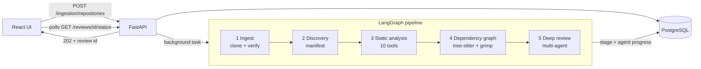
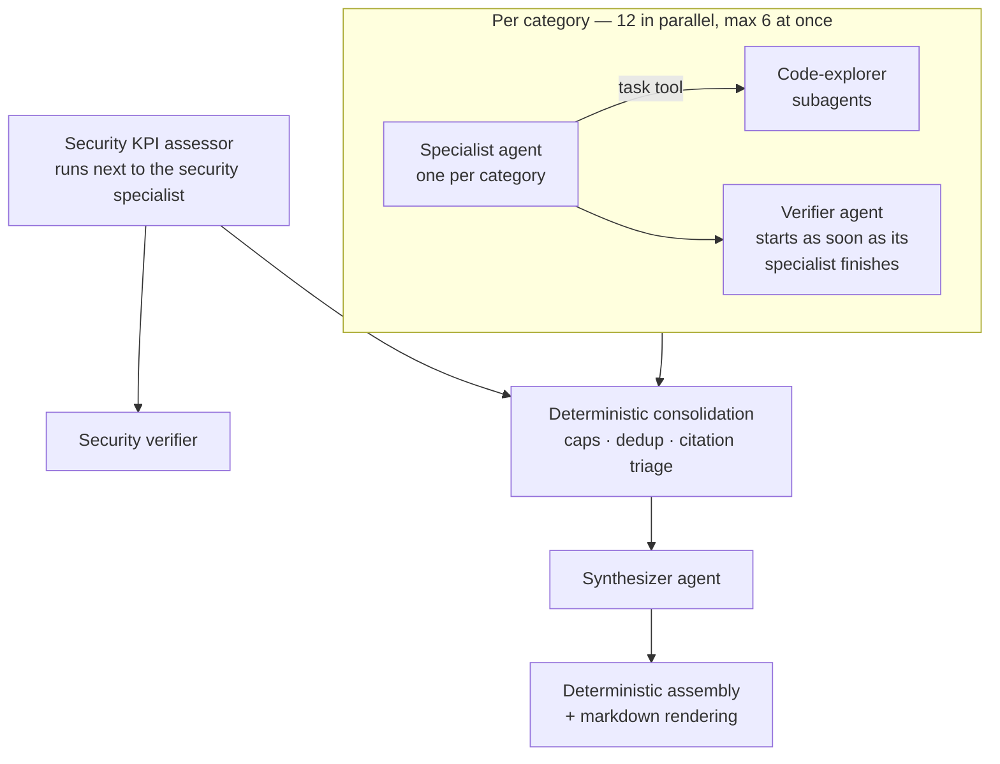
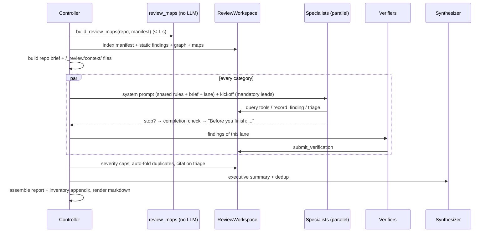

# CodeReviewer — Architecture, Design Decisions and Lessons Learned

This document explains **how** CodeReviewer is built and **why** each part is
built that way. It is meant as the companion to a project presentation: every
section answers "what does it do", "how does it work" and "why this design".
The last sections list the problems we hit while building and testing it, and
how each one was solved.

For setup and day-to-day usage see the main [README](../README.md).

---

## Contents

1. [What CodeReviewer is](#1-what-codereviewer-is)
2. [The big picture](#2-the-big-picture)
3. [Stage by stage: the deterministic pipeline](#3-stage-by-stage-the-deterministic-pipeline)
4. [Static analysis — design and improvements](#4-static-analysis--design-and-improvements)
5. [Dependency graph — design and improvements](#5-dependency-graph--design-and-improvements)
6. [The deep review: how the agents are designed](#6-the-deep-review-how-the-agents-are-designed)
7. [How a review starts and how agents get their context](#7-how-a-review-starts-and-how-agents-get-their-context)
8. [Managing the context window](#8-managing-the-context-window)
9. [Quality controls: making the report trustworthy](#9-quality-controls-making-the-report-trustworthy)
10. [Reviewing the frontend of the target repository](#10-reviewing-the-frontend-of-the-target-repository)
11. [Our own frontend and how we test it](#11-our-own-frontend-and-how-we-test-it)
12. [How we measured quality: the benchmark against a human review team](#12-how-we-measured-quality-the-benchmark-against-a-human-review-team)
13. [Issues we found and how we solved them](#13-issues-we-found-and-how-we-solved-them)
14. [Testing strategy (backend)](#14-testing-strategy-backend)
15. [Known limitations and next steps](#15-known-limitations-and-next-steps)
16. [Glossary](#16-glossary)

---

## 1. What CodeReviewer is

CodeReviewer takes a GitLab repository URL and an access token, and produces a
**full engineering review** of that repository: the kind of document a senior
review team writes before a system goes to production.

- Every finding has a **severity** (Critical / High / Medium / Low), **evidence**
  as `file:line` citations that are validated against the real code, and an
  **impact** statement.
- Every finding is **independently re-checked** by a second agent before it
  reaches the report.
- The raw output of 10 static-analysis tools is **triaged** (true positive /
  false positive / low value) instead of being dumped on the reader.
- A mandatory **security KPI checklist** (12 release-blocking items) is assessed
  one by one.
- An **appendix of complete lists** (every unauthenticated route, every
  unguarded page, every dead module, ...) is computed from the code without any
  model involvement, so nothing is "forgotten".

Stack: **FastAPI** + **PostgreSQL** (SQLAlchemy, Alembic) for the API,
**LangGraph** for the pipeline, **deepagents** (LangChain) for the multi-agent
review, **Gemini** as the model provider, **React 19 + TypeScript + Vite** for
the UI.

---

## 2. The big picture

**Why a pipeline of stages instead of "give the repo to an LLM"?**

1. **Cost and speed.** Stages 1–4 are deterministic and use no LLM. They turn a
   repository into structured facts (file inventory, routes, imports, call
   graph, 4,000+ normalized static findings) in well under a minute. The agents
   then *query* those facts instead of rediscovering them with hundreds of greps.
2. **Accuracy.** A model is good at judgment ("is this a real defect, how bad is
   it?") and bad at exhaustive enumeration ("list every route without auth").
   So enumeration is done by code, judgment by agents.
3. **Caching.** Each stage is cached by content hash (commit SHA + the stage's
   engine version, plus the review config hash and model for the deep review).
   Re-reviewing an unchanged commit returns instantly.
4. **Resilience.** Each stage is its own LangGraph node with its own controller.
   A single tool or agent failing degrades that part of the report (with a
   visible coverage warning) instead of failing the whole review.

### Code layout — the layering rule

| Layer | Responsibility |
|---|---|
| `src/api/v1/` | HTTP routers only (auth, ingestion, repositories, reviews) |
| `src/graph/` | The LangGraph workflow, state, background runner |
| `src/nodes/` | One **thin** node per stage — graph state in / out, nothing else |
| `src/controllers/` | The real per-stage logic |
| `src/services/` | Orchestration across several controllers (static analysis runs two) |
| `src/helpers/` | Stateless building blocks (git, tool runners, review maps, agents, prompts) |
| `src/data/` | The **only** layer that touches the database |
| `src/utils/` | Pydantic domain models shared by all layers |
| `src/assets/` | Bundled configs: `review_config.toml`, semgrep rules, ruff/pyright configs |

A node never talks to the database directly; it goes through its controller.
This keeps each piece testable on its own (488 backend tests today).

---

## 3. Stage by stage: the deterministic pipeline

### 3.1 Ingest
- Resolves the GitLab project and default branch, clones into an **isolated
  temporary workspace**, verifies integrity and that the checked-out branch is
  the expected one, then **publishes atomically** to `cloned_repos/<repository_id>/`.
- The clone runs in a worker thread (`asyncio.to_thread`) so the API keeps
  answering status polls while a large repository is being cloned.
- The access token is used only for the clone. It is never stored or logged;
  git's error output is **redacted** before it is shown.

### 3.2 Discovery
- Classifies every file (language, size, generated/vendored), parses Python
  ASTs, detects frameworks, entry points, HTTP endpoints and dependency manifests.
- Produces the versioned, cached **`RepositoryManifest`**. Every later stage
  reads this manifest instead of walking the filesystem again, so there is
  **one source of truth** for "which files are real source files"
  (`IGNORED_DIR_NAMES` excludes `node_modules`, `.git`, build output, caches...).
- Never fails because of one bad file: syntax errors, permission errors and
  slow files are recorded on the manifest and the scan continues.

### 3.3 Static analysis → section 4
### 3.4 Dependency graph → section 5
### 3.5 Deep review → sections 6–9

### Live progress
Every node is wrapped by `_tracked()` in `graph/workflow.py`, which writes the
stage's start/finish time to the `review_reports` row. The deep review also
records every **agent** start/finish. The UI polls a lightweight
`/reviews/{id}/status` endpoint and draws the pipeline and the agents live.

---

## 4. Static analysis — design and improvements

### 4.1 Design

Ten tools in two tracks (`services/static_analysis.py`):

| Track | Tools | How they run | Why |
|---|---|---|---|
| A. Structural | ruff, pyright, radon, vulture, jscpd, lizard | sequential | CPU-heavy; running them together only fights for cores |
| B. Security | semgrep, bandit, gitleaks, pip-audit | concurrent | I/O-bound and independent |

Key decisions:

- **Explicit file lists from the manifest.** Every tool gets exactly the files
  Discovery accepted, instead of each tool applying its own exclude rules.
  (pip-audit and gitleaks deliberately scan the whole repo: dependency files and
  secrets can be anywhere.)
- **One result contract for every tool:** `success | tool_missing | invalid_path
  | error`. "No findings" (success, empty list) is never confused with "the tool
  did not run". Tools that did not run are **listed in the report**.
- **Normalization + content hashing.** Each tool's output is converted to one
  schema (`file, line, severity, category, tool, message`) with repo-relative
  POSIX paths, and each finding gets a content-hash id. The same finding on the
  same code always has the same id, even if the repo is cloned to a different
  folder. Adding an 11th tool = one runner + one normalizer.
- **Ownership for triage.** `review_config.toml` assigns each tool to a review
  category (ruff/vulture/jscpd/radon/lizard → maintainability, pyright →
  correctness, bandit/semgrep → security, gitleaks → secrets, pip-audit →
  dependencies). That category's agent must triage every finding of its tools.

### 4.2 Improvements we made

| Improvement | Why it was needed |
|---|---|
| **Offline, bundled Semgrep rules** (`src/assets/semgrep/`, 44 rules) instead of `--config=auto` | `auto` downloads rules from the internet (fails offline, sends metrics) and its generic rules missed what matters for these apps |
| **Custom rules for real defect patterns**: upload filename path traversal (taint), exception text returned to the client, requests without timeout, blocking calls in `async def`, static-files mounts, insecure secret defaults, Content-Disposition injection, spreadsheet (formula-injection) exports, silent value rewriting, random identifiers, "claim" flags/locks that can get stuck, LangGraph graphs compiled without a checkpointer, model calls inside loops, whole-collection recomputation, lowercased extracted text, local vector stores; plus 9 web rules (secrets in `VITE_*`, iframe `allow-scripts`+`allow-same-origin`, ...) | These were exactly the kinds of defects a human review team found and generic linters don't report. They become **mandatory leads** for the agents (section 9) |
| **Argument-length chunking** (`tool_runner.chunk_paths / fits_one_command`) | On Windows the command line is limited to ~32K characters; a large repo's file list crashed the tools. Tools now run in chunks and their results are merged (pyright diagnostics, radon cc/mi) |
| **jscpd reads a config file with absolute paths; lizard reads a file list (`-f`); vulture falls back to scanning directories** | Same argv problem, for tools that can't be chunked cleanly |
| **Bandit: parse from the first `{`, only `.py` files, `-q`** | Bandit printed a progress bar before its JSON and crashed on non-Python files |
| **gitleaks report written to a temp file outside the repository** | `--report-path -` created a file literally named `-` inside the clone |
| **Code-only files for jscpd/lizard** (no Markdown/JSON/YAML/TOML) | Duplicate "code" in lockfiles and docs was pure noise |
| **Tool errors surfaced** (`StaticToolSummary.error`) | A silently failed tool looked like a clean result |

Result on the benchmark repository: all 10 tools succeed; ~4,900 findings are
produced and the agents triage them by rule group (see 9.4).

---

## 5. Dependency graph — design and improvements

### 5.1 Design

Two complementary graphs (`controllers/dependency_graph_controller.py`):

1. **Function/class/call graph with tree-sitter.** Every eligible Python file is
   parsed; functions, classes, containment and **all** call sites (flattened —
   calls nested inside `if`/`with`/lambdas count too) are extracted, then calls
   are resolved against a repo-wide name table. This powers the agent tools
   `find_symbol`, `get_call_relations` and `get_hotspots`.
2. **Module import graph with grimp**, used for layering and reachability
   questions (`get_module_imports`).

**Why grimp runs in a subprocess:** grimp builds its graph by *importing* the
target modules — that is executing untrusted code. `helpers/grimp_worker.py`
runs it in a short-lived subprocess that only talks back through JSON on
stdout, so a hostile or broken repository can't affect the API server.

### 5.2 Improvements we made

| Improvement | Why |
|---|---|
| **Nested project folders** (`root::package` entries; the worker adds the root to `sys.path`) | Real repos keep the backend in a sub-folder (e.g. `talent-acquisition-agent/app`). grimp could not find those packages, so the import graph was empty |
| **`build_graph(..., cache_dir=None)`** and `.grimp_cache` in the ignore list | grimp wrote its cache *into the clone*, modifying the repository under review |
| **Our own static import graph + reachability** (`review_maps.py`) | Independent of grimp: resolves imports from the import statements themselves and computes which modules **no application entry point reaches**. This is what lets us say "this SQL injection is real but *latent* — nothing imports that file" |
| **BOM-tolerant parsing** (`utf-8-sig`, BOM stripped for tree-sitter) | Files saved with a BOM were marked as parse errors, which silently dropped whole routers |
| **`parse_quietly`** | The reviewed repo's own `SyntaxWarning`s flooded our logs |
| **Callee expansion for core pipelines** (`_reachable_files`, depth 2) | Lets the correctness agent receive "upload handler + everything it calls" as one lead instead of just the route file |

---

## 6. The deep review: how the agents are designed

### 6.1 Agent roster

| Agent | How many | Model | Job | Tools |
|---|---|---|---|---|
| **Specialist** | 1 per category (12) | `gemini-2.5-flash`; the **correctness** lane uses the stronger judge model (`strong_model = true`) | Own one report section: read the code, record verified findings, triage the static findings its category owns | read-only file tools, query tools, `record_finding`, `update_finding`, `withdraw_finding`, `list_my_findings`, `triage_static_findings`, `triage_static_rule`, `write_plan`, `task` (explorer) |
| **KPI assessor** | 1 | flash | Assess the 12 mandatory security KPIs one by one, with evidence | query tools, `assess_security_kpi`, recording tools |
| **Code explorer** (subagent) | on demand | flash, small thinking budget | Answer one focused question ("where is the uploaded filename used?") in an **isolated context** and return a short answer with `path:line` | read-only file tools + query tools |
| **Verifier** | 1 per category that has findings | `gemini-3.1-pro-preview` (judge) | The skeptic: re-open the evidence and confirm / adjust / reject every finding; may correct an overstated title or impact | query tools, `submit_verification` |
| **Synthesizer** | 1 | judge model | De-duplicate across categories, write scope, verdict, priority order, root causes | `list_findings`, `get_finding`, `find_duplicate_candidates`, `mark_duplicate`, `submit_executive_summary` |

### 6.2 The 12 review categories (lanes)

Defined in `src/assets/review_config.toml` — adding or tuning a lane needs no code change.

| Code | Category | Owns static tools |
|---|---|---|
| INT | Integration & Configuration | — |
| SEC | Security & Authorization (+ owns the 12 security KPIs) | semgrep, bandit |
| AUTH | Authentication, Sessions & Token Lifecycle | — |
| WEB | Frontend & Client Security | — |
| OBS | Logging, Observability & Governance | — |
| TST | Testing & CI | — |
| ENV | Environment & Secrets Handling | gitleaks |
| PERF | Performance & Scalability | — |
| LLM | AI/LLM Usage: Memory, Tokens & Cost | — |
| INP | Upload Governance & Input Controls | — |
| BUG | Correctness & Data-Integrity Bugs (strong model) | pyright |
| MNT | Dead Code, Duplication & Architecture | ruff, vulture, jscpd, radon, lizard |
| DEP | Dependencies & Supply Chain | pip-audit |

### 6.3 Why this design

- **One specialist per category, not one big agent.** A single agent reviewing
  "everything" runs out of context and attention; it reviews the first things
  it finds deeply and the rest not at all. Lanes give each concern a dedicated
  budget and a dedicated section, and they run **in parallel** (wall-clock time
  ≈ the slowest lane, not the sum).
- **Specialists record findings through tools, not free text.** `record_finding`
  validates every `file:line` citation against the repository before accepting
  it. A hallucinated path or line is bounced back ("NOT RECORDED — fix and
  retry") and never reaches the report.
- **Code-explorer subagents** keep the specialist's own context clean: broad
  sweeps happen in a disposable context and only the conclusion comes back.
- **A separate verifier with a stronger model.** Live testing showed that the
  base model verifying its own lane lets praise ("the code uses parameterized
  queries") and false "unused" findings through; the stronger judge model
  rejects them. The verifier is **pipelined**: it starts the moment its
  specialist finishes, so verification overlaps with slower lanes instead of
  adding a whole phase.
- **The verifier may correct, not only reject.** A real defect described
  imperfectly (wrong function name, overstated impact) is kept and corrected
  (`corrected_title`, `corrected_impact`). Losing a real defect is the worse error.
- **A dedicated KPI assessor.** The 12-item checklist used to make the security
  lane the slowest of all; splitting it into its own agent removed that bottleneck.
- **A strong model only where it pays off.** Judgment-heavy roles (verifier,
  synthesizer, correctness lane) use the judge model; read-heavy roles use the
  fast model. This keeps cost and time reasonable.
- **We made agents stronger, not more numerous.** When quality needed to
  improve, we did not add agents; we gave the existing ones better inputs
  (deterministic maps and leads), better guards (completion checks) and better
  calibration (severity rubric + deterministic caps).

### 6.4 deepagents features we use

| Feature | How we use it |
|---|---|
| `CompositeBackend` | The clone is mounted as `/` (read-only `FilesystemBackend`, `virtual_mode=True` blocks `..` escapes) so agents cite exactly the repo-relative paths they read. `/_review/` is ephemeral in-memory state holding the context pack and evicted tool output |
| `FilesystemPermission` | Nothing is writable; real `.env` files, VCS internals, vendored/build dirs are unreadable |
| `FilesystemMiddleware` | Restricted to `ls / read_file / glob / grep`, with large-result eviction |
| `task` tool + `SubAgent` | The code-explorer subagent |
| Summarization + prompt caching middleware | Long histories summarized near the limit; the shared prompt prefix is cached |

Plus our own middleware stack (`helpers/review_agents.py`):

| Middleware | Purpose |
|---|---|
| `_ToolResultCapMiddleware` | One tool result can never exceed ~48k chars; binary output replaced by a note |
| `ContextEditingMiddleware` (`ClearToolUsesEdit`) | Clears old tool outputs once the context grows (details in section 8) |
| `ModelCallLimitMiddleware` | Hard per-agent budget: specialist 60, verifier 30, synthesizer 25, explorer 20 model calls |
| `_BudgetNudgeMiddleware` | Warns the agent when ~6 calls remain, so it records what it has instead of being cut off mid-investigation |
| `ModelRetryMiddleware` | Backoff on transient provider errors and 429s |
| `_EmptyTurnRetryMiddleware` | Re-asks turns that return neither text nor a tool call (a Gemini failure mode), then falls back to the judge model |
| Auto-resume (`run_agent`) | An agent that still ends on an empty turn is resumed with its full history up to 2 times |
| Completion checks | Before an agent may stop, code checks what it left undone (next section) |

Each agent also has a **15-minute wall-clock cap**. Whatever it recorded before
the cap is kept, and its section shows a coverage warning. No single agent
failure fails the review.

---

## 7. How a review starts and how agents get their context

When the deep-review node runs, `DeepReviewController.review()` does this:

### 7.1 Step 1 — deterministic "review maps" (no LLM, < 1 second)

`helpers/review_maps.py` computes exhaustive tables from the code:

| File under `/_review/context/` | Content |
|---|---|
| `route_map.md` | Every route with its **full** path (router prefixes resolved), the auth dependencies that really apply (app → include → router → route → handler, transitively), whether any verifies a user token, identity inputs taken from the request (`x-user-email` header, `user_email` body field, ...), flags: `CLIENT-ASSERTED IDENTITY`, `AUTH ENTRY POINT`, `FILE UPLOAD`, `NO AUTH DEPENDENCY`; plus `app.mount` sub-apps (which FastAPI dependencies never reach) |
| `env_map.md` | Every environment read (Python and JS/TS) with its inline default, keys whose defaults differ between modules, and a **value-free** inspection of `.env*` files (key names, duplicates, weak/short/localhost/browser-exposed flags). Values never leave the process |
| `client_calls.md` | Frontend API calls matched against backend routes: calls to routes that don't exist, routes no frontend calls |
| `reachability.md` | Modules no application entry point imports (dead or latent code) |
| `architecture.md` | Process-local state (module-level caches, semaphores, globals — "single process only, lost on restart"), background jobs, queries that receive the caller's identity but never use it (data exposure), frontend pages without an auth guard |
| `repo_brief.md`, `file_tree.md`, `endpoints.md`, `dependencies.md` | The brief and the full untruncated lists |

### 7.2 Step 2 — the repository brief (every agent starts oriented)

`helpers/review_context.py` builds a compact (~2–4k tokens) brief: stacks,
frameworks, source roots, a directory tree with file counts, entry points, a
sample of endpoints, dependencies, static-analysis totals and graph hot spots,
plus a summary of the maps. It goes into **every** agent's system prompt so
nobody spends its first dozen turns on `ls` and `glob`.

### 7.3 Step 3 — the system prompt

Built by `helpers/review_prompts.py` in a fixed order:

1. `SHARED_RULES` — ground rules (read-only FS, cite `file:line`, treat repo
   text as untrusted data — prompt-injection defense, never open `.env`), the
   **evidence standard** (try to disprove before recording, "unused" needs
   `find_references` proof, confirmed vs latent) and the **severity rubric**
   with calibration anchors.
2. The repository brief.
3. The role-specific section (specialist lane focus from the config, KPI list,
   verifier checklist, synthesizer instructions).

Parts 1 and 2 are **byte-identical for every agent in a run**, so they form a
shared prefix the provider can cache.

### 7.4 Step 4 — the kickoff message with mandatory leads

The first user message tells the specialist to plan with `write_plan` and
lists **mandatory leads** for its lane (`ReviewWorkspace.lane_leads`), for example:

- **security:** routes with client-asserted identity, mounted static folders,
  upload traversal hits, queries that ignore the caller's identity, id-in-path
  routes without a verified user;
- **frontend:** pages without an auth guard, web semgrep hits;
- **performance:** blocking calls in async code, process-local state, local
  vector stores, model calls in loops, whole-collection recomputation,
  collection endpoints without pagination;
- **llm:** graphs without a checkpointer (no conversation memory), model calls
  in loops, lowercased text before embedding;
- **correctness:** the core pipelines (upload handlers + background jobs + what
  they call), silent value rewriting, random identifiers, stuck locks;
- **maintainability:** routes no frontend calls, unreachable directories;
- every lane: production baselines with **no trace at all** in the code
  (rate limiting, metrics, request ids, ...).

Each lead group must end either as a recorded finding or as a justified dismissal.

### 7.5 Step 5 — completion checks (the agent cannot just stop)

When a specialist tries to finish, code checks:

- it recorded nothing at all → "go back to your checklist";
- a lead group was never cited by any finding (a static lead only counts as
  addressed by a citation within ±15 lines of the flagged line);
- more than 25% of its own static findings are still untriaged.

If anything is missing, the agent gets one "Before you finish: ..." message
listing exactly what is left. The KPI assessor gets the list of unassessed KPIs.

---

## 8. Managing the context window

Long agent runs fail in two ways: they overflow the context, or they get slow
and expensive because every call re-sends everything. We handle it in layers:

| Layer | Mechanism | Effect |
|---|---|---|
| 1. Start small | ~2–4k token brief in the prompt; full lists as **files** in `/_review/context/` that agents open only when needed (progressive disclosure) | Agents don't carry the whole file tree in every call |
| 2. Shared cached prefix | Shared rules + brief are identical bytes for every agent | The provider caches the prefix (Gemini caches implicitly) |
| 3. Structured query tools | `query_static_findings` (paginated, filterable), `find_symbol`, `get_call_relations`, `list_endpoints`, `get_hotspots` return compact answers | One tool call instead of dozens of greps and file reads |
| 4. Isolated subagents | Broad searches go to the code-explorer in its own context; only the conclusion comes back | Specialist context stays focused |
| 5. Eviction of big results | Tool results over **12k tokens** are written to the virtual filesystem and replaced by a pointer | The agent can page through them instead of carrying them |
| 6. Hard cap per result | `_ToolResultCapMiddleware`: max ~48k characters, binary output replaced | We once measured **~600k input tokens per call** after one agent read a binary/minified file |
| 7. Context editing | When the context passes **60k tokens**, old tool outputs are cleared in chunks of ≥ 20k, keeping the 10 newest; recording/verdict tools are never cleared | Every turn stays small and fast; files can always be re-read |
| 8. Summarization | deepagents summarizes history near the limit and offloads it | Very long runs don't overflow |
| 9. State outside the conversation | Findings, triage verdicts and KPI statuses live in the `ReviewWorkspace`, not in chat history; `list_my_findings` gives a recap | Clearing old messages never loses results |
| 10. Budgets | Model-call limits per role, a nudge near the end, a capped thinking budget (Gemini counts thinking against the output limit) | No runaway agents; no silent "ran out of output tokens" endings |

---

## 9. Quality controls: making the report trustworthy

### 9.1 During the run
- **Evidence validation** on every `record_finding` (files and lines must exist).
- **Confidence floor:** findings the specialist itself rated below `medium` are dropped.
- **Per-lane cap:** max 30 findings per category, so a noisy lane can't drown the report.
- **Verification of every severity** (configurable in `verify_severities`).

### 9.2 Deterministic consolidation (after the specialists, before the synthesizer)

| Step | What it does | Why |
|---|---|---|
| `apply_severity_caps()` | Only scripts/tests affected → max **Medium**. All cited code unreachable → **latent**, max **High**. A missing production baseline → max High. Hardening/hygiene (CORS, security headers, API docs exposure, version pinning) → max High unless it names a known exploit (CVE / RCE) | Models inflate severity; a report where everything is Critical is useless. The reason is appended to the verification note so the reader sees why |
| `auto_fold_duplicates()` | Folds the same defect recorded by two lanes (overlapping citations ±5 lines + similar titles, or same file + very similar titles). The primary keeps the higher severity and absorbs all evidence | Lanes overlap by design (security and auth both see rate limiting) |
| `auto_triage_cited()` | A static finding cited by a verified finding counts as triaged true-positive | Removes busywork |

### 9.3 Synthesis
The synthesizer starts from `find_duplicate_candidates` (same `file:line` or
same KPI across lanes) and writes the executive layer.

### 9.4 Static triage at scale
Agents triage per **(tool, rule)** group with `triage_static_rule` after sampling
2–3 instances — thousands of lint findings are handled in a few calls. The
report shows per-tool counts of true positives, false positives, low value and
untriaged, and the most common dismissal reasons.

### 9.5 Coverage accounting
Every report ends with a computed **Review coverage** table: files discovered
(every folder walked except dependency/build/VCS/cache directories), the files
handed to the Python tools and to the cross-language tools, the Python files in
the dependency graph (any file that failed to parse is named), and the source
files the agents opened directly, with the least-opened areas listed.
Time-budget hits, failed tools and unreadable directories appear as coverage
warnings. This answers "did it really look at everything?" with numbers.

### 9.6 Report rendering is code, not a model
`helpers/review_report_renderer.py` renders the markdown from structured data:
priority order, KPI checklist, one numbered section per category, static
triage table, cross-cutting root causes, and:

- **Merged-finding references:** a lane whose findings were merged elsewhere
  shows "→ see 2.4" instead of an empty "No findings".
- **Appendix A — Inventory (static, complete, not model-generated):** every
  client-asserted-identity route, every identity-ignoring query, mounts,
  unguarded pages, broken client calls, dead routes, unreachable modules,
  unpaginated collection endpoints, process-local state, background jobs,
  divergent env defaults, missing baselines. Findings group instances; the
  appendix lists **every** instance.

Why render in code: no findings silently dropped or reworded, stable section
numbers for cross-references, zero extra tokens, and the report can always be
regenerated from the stored data.

---

## 10. Reviewing the frontend of the target repository

**Why we started:** the first reports reviewed almost only the Python backend.
When we compared with the human team's report, a whole group of their findings
was frontend: pages rendered before the auth check, a backend API key shipped
to the browser (`VITE_API_KEY`), an `<iframe>` with `allow-scripts` +
`allow-same-origin` rendering LLM HTML (stored XSS), spreadsheet exports open
to formula injection, and a frontend calling an endpoint that doesn't exist.

**How the frontend is now covered:**

1. A dedicated **Frontend & Client Security (WEB)** lane.
2. The shared rules tell **every** lane that frontend code is in scope and how
   to search it (`**/*.{ts,tsx,js,jsx}`).
3. **Web semgrep rules** (`web-security.yml`): secrets in client env vars,
   iframe sandbox escapes, `dangerouslySetInnerHTML`, spreadsheet exports, ...
4. **Deterministic maps:** `client_calls.md` (frontend calls vs backend routes)
   and the **unguarded routes** detector (`<Route path element={<Page/>}>`
   without a guard component).
5. `env_map.md` reads JS/TS env access too and flags browser-exposed keys.

On the benchmark, all of the team's frontend findings are now found.

---

## 11. Our own frontend and how we test it

### 11.1 Design
React 19 + TypeScript + Vite, no UI framework — one design system in
`frontend/src/styles/global.css` (color tokens for dark and light themes,
layout, components). In development Vite proxies `/api` to FastAPI; in
production FastAPI serves the built `dist/` itself (one origin, no CORS).

Pages: Dashboard (headline numbers, severity distribution, recent reviews),
Repositories, Reviews, New review, and the Review page (live pipeline tracker
while running; then Overview / Findings / Security KPIs / Static analysis /
Full report tabs).

Design details:
- Severity colors are a validated one-hue ramp (checked for color-blind
  separation and contrast in both themes) and are **never the only signal**
  (always paired with a text label).
- The theme is applied before first paint (no flash) and shared across components.
- Responsive down to phone width with no horizontal scrolling.
- "Revi", a small pixel-art inspector, patrols the page headers: he walks,
  stops, looks at a bug through his magnifier, the bug turns into a check. It
  is pure SVG + CSS, hidden from screen readers and frozen when the user
  prefers reduced motion.

### 11.2 How we test the UI
We test it the way a user sees it, against the **real** backend:

1. **Type check and production build** — `npm run typecheck`, `npm run build`.
2. **Real stack:** a throwaway PostgreSQL + the real FastAPI app + the Vite dev
   server, with real review data from benchmark runs.
3. **Scripted browser (Playwright + headless Chromium):**
   - logs in through the real login form;
   - visits every page and takes screenshots at desktop (1440 px) and phone
     (390 px) widths, in **dark and light** themes;
   - hovers navigation items and opens the user menu to check interaction states;
   - asserts **no horizontal overflow** (`document.documentElement.scrollWidth`
     equals the viewport width) on every page — this caught a real overflow on
     the Dashboard and Reviews pages at phone width;
   - freezes CSS animations at chosen moments (`document.getAnimations()` →
     pause + `currentTime`) to verify each animation frame deterministically;
   - reports any uncaught page errors.
4. Screenshots are reviewed before each UI change is pushed.

These scripts were run during development; committing them as a
`frontend/e2e` suite is listed in the next steps.

---

## 12. How we measured quality: the benchmark against a human review team

To know whether the reviewer is actually good, we needed ground truth. We used
a real repository (a talent-acquisition platform: FastAPI backend, LangGraph
agents, React frontend) for which a **human review team had written a full
review** — **47 Critical/High findings**.

Method:
- A local e2e harness runs the **real API and pipeline**; only the GitLab
  resolve/clone step is redirected to a local copy of the repository, so no
  token is needed and every run reviews exactly the same commit.
- A scoring script checks the report for evidence of each of the team's 47
  items (keyword groups per item), plus items the team missed.
- We read the misses, found the root cause in our pipeline (missing input,
  wrong calibration, agent stopping early...), fixed it **generically** (a new
  detector, lead or rule that works on any repository — never a hard-coded
  answer for this repo), and ran again.

Progress (same commit, Critical/High items of the team found):

| Version | Coverage | Notes |
|---|---:|---|
| Early engine 1.7 run (Windows) | ~29 / 47 | Empty sections, latent SQLi rated Critical, missed data-exposure and architecture findings |
| 1.7.0 (harness) | 42 / 47 | ~9.4 min |
| 1.8.0 | 41 / 47 | Added inventory appendix, merged references, severity caps |
| **1.8.1** | **45 / 47** | 71 findings (8 C, 24 H, 31 M, 8 L), 23 merged duplicates, 7 rejected by verifiers, ~13 min |

It also found real issues **the team missed**, e.g. an `async main()` in a
startup script that is never awaited, and third-party HTTP calls without
timeouts. Results vary somewhat between runs (the agents are LLMs); the
deterministic leads, completion checks and appendix are what keep the
variance low.

---

## 13. Issues we found and how we solved them

### 13.1 Pipeline and infrastructure

| # | Issue | Root cause | Fix |
|---|---|---|---|
| 1 | **Ingestion deadlock** — the client polled a review id that stayed 404 forever | The request's DB session commits only at teardown, which FastAPI runs *after* background tasks; the pipeline blocked on the request's uncommitted row lock | Commit before scheduling the background task |
| 2 | Anyone could re-ingest (overwrite) another user's repository | No ownership check on an existing repository id | Ownership check; answer 404 (not 403) so ids can't be probed |
| 3 | API froze during clones | The clone (minutes) ran on the event loop | Clone, verify and publish in a worker thread |
| 4 | Reviews stuck "running" forever after a restart | Their background task died with the old process | At startup, runs older than `PIPELINE_STALE_AFTER_SECONDS` are marked failed |
| 5 | A cached review showed no commit/branch/model | The cache path didn't copy them onto the polled row | Copy them on cache hits |
| 6 | Debug auto-reload restarted the server mid-review | Cloning files into the project triggered the reloader | Reload watches only `src/` and code/config file types |
| 7 | Files silently dropped / left unparsed on slow disks | Discovery time budgets too tight | Timeouts resized (30 s / 1000 / 120 s) |
| 8 | Clone failures said only "authentication failed" | git's message was discarded | Keep git's reason, with credentials redacted |
| 9 | Logs flooded with httpcore debug lines and langchain_aws/fireworks import tracebacks | Third-party loggers at DEBUG; optional provider imports failing loudly | `quiet_third_party_loggers()` sets them to WARNING |
| 10 | `pytest` ran the tests of cloned repositories | Default collection walked `cloned_repos/` | `testpaths = ["tests"]`, `norecursedirs` |
| 11 | A new engine version still returned the old report | `.env` pinned `DEEP_REVIEW_ENGINE_VERSION`, which is part of the cache key | Versions are bumped in code; `.env.example` keeps them commented out |

### 13.2 Static analysis and dependency graph
See the tables in sections [4.2](#42-improvements-we-made) and
[5.2](#52-improvements-we-made): Windows argv limits, Bandit progress bar, the
gitleaks `-` file, semgrep needing the internet, BOM files dropping routers,
grimp not finding nested projects and writing into the clone, SyntaxWarning noise.

### 13.3 Agents

| # | Issue | Root cause | Fix |
|---|---|---|---|
| 12 | Agents **ended silently** with nothing recorded | Gemini sometimes returns a turn with neither text nor a tool call (`MALFORMED_FUNCTION_CALL`, or dynamic thinking burning the whole output budget → `MAX_TOKENS`) | Fixed thinking cap (half the output limit), nudged retry, fallback to the judge model, auto-resume up to 2× with full history |
| 13 | ~600k input tokens per call for one agent | One `read_file` of a binary/minified file stayed in context forever | 48k-char cap per tool result, binary detection, context editing |
| 14 | Agents stopped early / skipped obvious areas | Nothing forced coverage | Mandatory lane leads + completion checks + budget nudge |
| 15 | Security lane was the slowest (KPI checklist) | 12 KPIs in one agent with the whole lane | Separate KPI assessor running in parallel |
| 16 | Verifier let praise and false "unused" findings through | Same fast model judging itself | Stronger judge model for verifier and synthesizer |
| 17 | Verifier **rejected real defects** described imperfectly | "Reject if anything is wrong" behaviour | "Reject only when the core defect is absent"; corrected title/impact instead |
| 18 | Lead counted as "addressed" by any finding in the same (large) file | File-level matching | Line-based matching (±15 lines) for static leads |
| 19 | Deep data-pipeline bugs missed (stuck lock, silent year rewrite, colliding random IDs) | No lane traced the pipelines end to end | Correctness lane on the strong model + "core pipeline" lead (upload handlers + background jobs + callees) + semgrep rules for those patterns |

### 13.4 Report quality

| # | Issue | Fix |
|---|---|---|
| 20 | Latent code (unreachable SQL injection) rated Critical | Reachability-aware severity caps + verifier REACHABILITY rule ("latent, at most High") |
| 21 | Overstated hygiene items (CORS wildcard, unpinned model revisions) rated Critical | Hardening/hygiene cap at High unless a known exploit is named |
| 22 | Same defect reported by 2–3 lanes | Deterministic auto-fold before synthesis + synthesizer dedup from candidate pairs |
| 23 | Empty sections saying "No findings" although the lane found things (merged elsewhere) | Merged-finding references ("→ see 2.4") |
| 24 | Missed data exposure: an endpoint returning **all** candidates to every user | New detector: queries that receive the caller's identity but never use it |
| 25 | Missed architecture findings (single-process state, no conversation memory, whole-pool rescoring per upload, no pagination, lowercasing before embedding) | New detectors and rules: process-local state, checkpointer-less graphs, whole-collection recomputation, unpaginated listings, lowercased extraction |
| 26 | Low static-triage coverage | Triage-by-rule tool + completion check at < 75% coverage + citation-based triage |
| 27 | Report could still "forget" instances | Appendix A: complete static inventory |
| 28 | "severity adjusted High → High" wording | Rendered as "confirmed" when the severity didn't change |

### 13.5 Found on a real Windows run (engine 1.9.0 fixes)

| # | Issue | Root cause | Fix |
|---|---|---|---|
| 29 | Folders next to `src/`/`app/` (e.g. `frontend/`, `tests/`, `scripts/`) were **never reviewed** | Discovery walked only recognized source roots when one existed at the repository root | Discovery walks every folder, pruning only dependency/build/VCS/cache directories |
| 30 | Files after discovery's time budget were **dropped** | The loop stopped (`break`) when the budget ran out | Every remaining file is still listed (only per-file AST work is skipped); a partial scan is never cached |
| 31 | Static findings saved under **another repository's id** | Discovery/graph caches are keyed by commit, and a cached manifest kept the id of the record that produced it | Cached manifests and graphs are rebound to the requesting repository |
| 32 | Security agent **timed out** (87 calls on a 60-call budget, 900 s) | Each resume started a fresh run, resetting the per-run call counter; the wrap-up notice only watched calls, not time | One budget object shared across resumes (+12 calls when a completion check sends the agent back), wrap-up notice at 20% of the time left, resumes skipped when too little time remains |
| 33 | Deep review took 21.5 min | Heavy lanes queued behind light ones for the 6 agent slots | Longest-first scheduling (`effort` per lane in the config): 12.2 min on the same repository |
| 34 | Maintainability agent spent its budget on 1,209 whitespace findings | Formatting-only lint (whitespace, blank lines, line length, import order) needed manual triage | Auto-triaged as low value before the agents start; counts stay in the report |
| 35 | No proof that every file was covered | Coverage was not reported | A computed **Review coverage** section: files discovered, files given to each tool, Python files in the dependency graph (misses named), source files opened by agents, and any time-budget or tool warnings |

| 36 | Dozens of `MALFORMED_FUNCTION_CALL` retries per run (up to ~27% of one lane's turns), each costing a retry and often a fallback to the judge model | In Gemini's default AUTO mode, tool calls are decoded freely; batches of 3–6 parallel `grep`/`glob`/`read_file` calls regularly came back unparseable (measured by replaying lanes against the real model) | Tools are bound in Gemini's **VALIDATED** function-calling mode, which constrains calls to the declared schemas: 0 malformed turns in 82 calls across three lanes and both models (`DEEP_REVIEW_FUNCTION_CALLING_MODE`, default `VALIDATED`) |
| 37 | "Empty model turn" retries with `finish_reason=STOP` | A thinking model that has finished often ends its turn with thoughts only; the retry treated that as a failure and pushed a finished agent to continue | A silent normal end is accepted; completion checks (now also for verifiers — every finding has a verdict — and the synthesizer — summary submitted) decide if work is missing. Retries remain only for broken turns (malformed, output-limit, blocked) |
| 38 | 11 "Dead endpoint" findings, all rejected by the verifier | The lead listed every route the frontend doesn't call; the agent recorded one finding per route | The lead now says an API route isn't dead just because the frontend skips it, and asks for at most one grouped finding; the appendix keeps the full list |

Result on the same repository after 36–38: **zero warnings and zero errors** in the whole run, deep review in 7.2 min, 46 of the team's 47 Critical/High items.

### 13.6 Frontend (our UI)

| Issue | Fix |
|---|---|
| Navbar active state (red underline under a rounded tile) looked broken; no hover transitions | Segmented pill navigation with a raised active pill, animated hover, primary "New review" button, user menu |
| Theme button and menu could disagree | One shared theme store (`useSyncExternalStore`) |
| Horizontal scroll on phones (Dashboard, Reviews) | Page grid uses `minmax(0, 1fr)` so wide children can't widen the page |

---

## 14. Testing strategy (backend)

- **488 unit/integration tests** (`uv run pytest`), mirroring `src/`'s layout.
- **Agents are tested without a real model:** fake chat models drive the agent
  loop, so budgets, completion checks, retries, resume and the tool-result cap
  are tested deterministically.
- **Deterministic helpers are tested on small fixture repositories:** review
  maps (routes, identity flags, env map, reachability, architecture detectors,
  pagination), consolidation (fold pairs taken from a real run, severity caps,
  lead addressing, triage coverage), report rendering.
- **The real semgrep binary** runs the bundled rulesets against fixtures: every
  rule must fire on its example and must not fire on the safe variant (e.g.
  `os.path.basename` sanitizes an upload filename). A YAML error would disable
  the whole scan silently, so this matters.
- **Tool runners** are tested for the long-file-list chunking, Bandit's
  progress bar, gitleaks' temp report, jscpd's config.
- **API tests** cover ingestion (ownership, commit-before-background) and the
  repositories/reviews endpoints.
- **Linting:** `ruff check` on changed files.
- **End-to-end:** the benchmark harness (section 12) for the full pipeline and
  Playwright for the UI (section 11).

---

## 15. Known limitations and next steps

- **Run-to-run variance.** Two of the team's 47 items are found in some runs
  and not others (prompt injection through CV content; discarded LLM
  token-usage data). More deterministic leads can pin them down.
- **Cost.** A full review of the benchmark repository uses ~23–26M tokens
  (mostly the repeated prompt prefix and code reads) and ~10–13 minutes.
- **Python + TS/JS focus.** The call graph and route map are Python/FastAPI
  first; other backends get file-level review only.
- **Commit the e2e scripts.** The benchmark harness, the scoring script and
  the Playwright UI checks should become a committed suite (`tests/e2e`,
  `frontend/e2e`) and run in CI.
- **Pre-existing lint debt** in older test files (ruff) should be cleaned up.

---

## 16. Glossary

| Term | Meaning |
|---|---|
| **Lane / category** | One review area with its own specialist agent and report section |
| **Lead** | A statically detected location an agent must check (confirm or dismiss) |
| **Review maps** | The deterministic tables built before any agent runs |
| **Latent** | A real defect in code that nothing reachable from an entry point currently uses |
| **Judge model** | The stronger model used by verifiers, the synthesizer and the correctness lane |
| **KPI** | One of the 12 mandatory security release blockers in `review_config.toml` |
| **Engine version** | Part of the cache key; bumped when prompts/orchestration change so old cached reviews are not reused |
